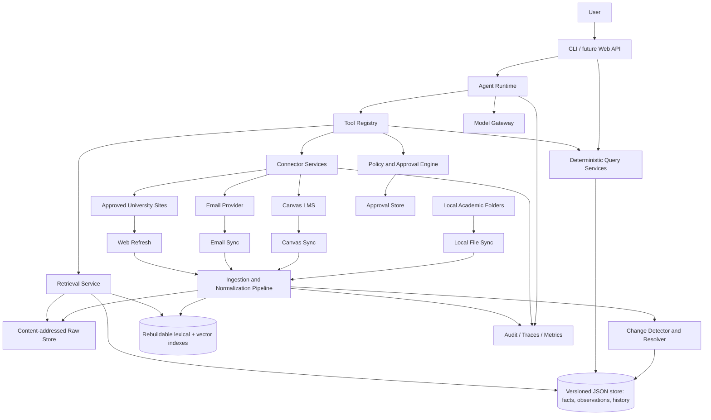

# Academic Management AI Agent — Architecture

Status: Proposed — V0.1 JSON-first  
Audience: student developer, future maintainers, coding agents  
Primary implementation language: Python 3.12+  
Architecture style: local-first modular monolith  
Last updated: 2026-09-16

## 1. Executive Summary

This project is a personal **Academic Operating System** for university coursework. It continuously builds a current, evidence-backed view of courses, assignments, materials, announcements, institutional dates, and academic email. A single primary agent answers questions and proposes actions by calling narrow, typed tools over that state.

The central design rule is:

> The canonical local store holds facts. Retrieval finds evidence. Tools interact with external systems. The LLM reasons over evidence and decides what to do. The LLM is not the source of truth.

A second, equally important rule is:

> External content is untrusted data, not executable instructions.

V0.1 is a local Python modular monolith with a CLI, a versioned JSON file store, rebuildable lexical/vector indexes, deterministic synchronization pipelines, and one controlled LLM tool loop. It deliberately supports one process and one writer on one computer. Canvas and local files are integrated first. SQLite is the planned next persistence adapter when concurrency, query volume, or operational complexity exceeds the explicit JSON limits.

The system does not overwrite a fact merely because a newer payload arrived. It preserves raw source snapshots and normalized observations, computes change events, and maintains a current resolved projection. Conflicts are resolved per fact type using authority, directness, scope, and freshness. Ambiguous high-impact conflicts—especially deadline changes—are surfaced rather than silently guessed.

## 2. Goals

1. Maintain a unified, current academic state across local files, Canvas, approved university sites, and academic email.
2. Answer course-scoped and cross-course questions with traceable citations.
3. Detect important changes, including deadline, description, module, material, announcement, and policy changes.
4. Support planning: due-soon views, attention queues, daily study suggestions, and later user-managed tasks.
5. Keep private content local by default and minimize data sent to model providers.
6. Make every persistent fact attributable to one or more source observations.
7. Make synchronization incremental, idempotent, retryable, and inspectable.
8. Enforce a hard permission boundary between read-only operations and external mutations.
9. Keep business logic independent of a particular LLM provider, vector engine, email provider, or UI.
10. Be small enough for one student to build and operate incrementally.

## 3. Non-Goals

The MVP will not:

- submit assignments, enroll/drop courses, or modify Canvas content;
- autonomously send, delete, archive, move, or relabel email;
- use browser automation to bypass Canvas or email access controls;
- execute code found in course files, notebooks, archives, email, or web pages;
- act as a grade predictor or make high-stakes academic-policy decisions without cited official evidence;
- continuously run when the user's computer is off;
- implement multi-agent orchestration, microservices, Kubernetes, Kafka, or distributed workflows;
- mirror all Canvas or mailbox data indiscriminately;
- replace the user, instructor, registrar, advisor, or official course system as the final authority;
- treat LLM-extracted facts as authoritative without retaining their evidence and confidence.

## 4. Assumptions

- The system serves one user and normally runs on one trusted personal computer.
- UIUC is the initial institution, but institution-specific rules live behind configuration and connectors.
- The user can supply a Canvas API token or complete an OAuth flow if UIUC permits it. API availability is not assumed.
- Email provider is not fixed. Gmail API, Microsoft Graph, and read-only IMAP are possible adapters.
- The initial academic corpus is small enough to load normalized JSON state into memory and use local rebuildable indexes.
- V0.1 has one active application process and one writer; concurrent writers and network filesystems are unsupported.
- Timestamps are stored in UTC, with source timezone and original text retained where ambiguity matters.
- The user explicitly configures academic root directories and allowed university domains.
- Model API use is optional for deterministic ingestion and state queries; semantic extraction and synthesis require a configured model.

## 5. Key Use Cases

### 5.1 Deterministic state queries

- List all deadlines in the next seven days.
- Show incomplete work grouped by course.
- Show records whose source is stale or whose sync failed.
- Show changes since a given timestamp.

These queries should be answered primarily from normalized storage, not RAG.

### 5.2 Evidence synthesis

- Summarize what changed in CS128 this week.
- Explain iterator invalidation using only CS128 materials.
- Find what the professor said about MP2 across announcements and email.
- Compare Canvas, email, and syllabus statements about a deadline.

These combine structured queries, metadata-filtered retrieval, and citations.

### 5.3 Planning

- What should I do tonight?
- Build a study plan from due dates, estimated effort, task status, recent materials, and available time.

The LLM may recommend and prioritize, but it must expose the underlying deadlines and assumptions.

### 5.4 Controlled actions

- Draft a reply locally.
- Create or update a personal task.
- Later, send an approved email or create a calendar event.

External mutations require a preview and explicit, action-specific approval.

## 6. System Context

### Actors

- **User:** configures sources, asks questions, resolves identity mappings, and approves mutations.
- **Primary agent:** interprets requests, invokes safe tools, retrieves evidence, and synthesizes responses.
- **Sync engine:** imports and reconciles data independently of chat requests.
- **External systems:** Canvas, email provider, approved university sites, model and embedding providers.
- **Local system:** academic folders, canonical JSON store, content store, indexes, logs, and scheduler.

### Trust boundaries

1. User/system/developer instructions are control input.
2. Tool definitions and policy configuration are trusted application code.
3. Local files, Canvas text, web pages, and email are untrusted content even when their authors are trusted academically.
4. Connector responses are authenticated data but are not executable instructions.
5. Model output is untrusted until validated against schemas and authorization policies.

## 7. High-Level Architecture

The architecture is a modular monolith: one repository, one deployable application, and one canonical local JSON store. Modules communicate through typed application services and repository interfaces rather than importing persistence details. The JSON adapter is intentionally replaceable by SQLite without changing domain or application services.



## 8. Main Components

### 8.1 Interfaces

- **CLI:** initial user interface for configuration, sync, state inspection, search, chat, approvals, and diagnostics.
- **FastAPI:** introduced when a dashboard or local HTTP integrations need it. The CLI should initially call application services directly, not require a server process.
- **Future frontend:** consumes stable API DTOs and never talks directly to storage or connectors.

### 8.2 Application services

- `AcademicStateService`: deterministic course, assignment, deadline, attention, and change queries.
- `SyncCoordinator`: schedules and tracks connector-specific sync runs.
- `NormalizationService`: converts source payloads into versioned observations.
- `ResolutionService`: computes current effective facts and conflict records.
- `DocumentService`: parsing, versioning, chunking, and indexing.
- `RetrievalService`: hybrid retrieval with filters, ranking, deduplication, and citations.
- `AgentRuntime`: bounded model/tool loop and final response production.
- `PolicyService`: authorization, approval, path, domain, and tool rules.
- `AuditService`: privacy-aware structured events and traces.

### 8.3 Infrastructure adapters

- Canvas API/OAuth adapter.
- Gmail, Microsoft Graph, or IMAP email adapter.
- Local filesystem adapter.
- Restricted web fetch/search adapter.
- Versioned JSON repositories, schema upgrader, generation writer, and file lock.
- Vector index adapter.
- Model/embedding provider adapters.
- Secret store and scheduler adapters.

### 8.4 Recommended technology baseline

| Concern | MVP choice | Rationale / boundary |
|---|---|---|
| Language | Python 3.12+ | strong document/AI ecosystem; pin the exact supported version in `pyproject.toml` |
| CLI | Typer | typed, low-friction commands; application services remain framework-independent |
| HTTP | httpx | async support, explicit timeouts, test transports |
| Validation | Pydantic v2 | use for config, connector DTOs, tool schemas, and API boundaries—not as persistence/domain coupling |
| Persistence | JSON/JSONL generation store | transparent, inspectable, no SQL dependency; single-writer and small-corpus only |
| Schema/versioning | Pydantic models + explicit `schema_version` upgraders | validate every committed generation and preserve a migration path |
| Lexical retrieval | in-memory scan first; persisted inverted index if needed | index is derived and can always be rebuilt from canonical chunks |
| Vector retrieval | FAISS or a simple local adapter | hidden behind `VectorIndex`; vectors are never canonical storage |
| Parsing | PyMuPDF/pypdf, python-docx, python-pptx | parser adapters record versions and warnings |
| CLI scheduling | manual commands + APScheduler/OS scheduler | no broker or distributed worker |
| Logging/tracing | structlog + OpenTelemetry-compatible spans | local JSON exporter first, with redaction |
| Testing | pytest, Hypothesis, respx | unit/property tests, HTTP contracts, deterministic fixtures |
| Backend API | FastAPI when a dashboard/OAuth callback needs it | useful choice, but not a required process for the CLI MVP |

Python, Pydantic, and a generation-based JSON store minimize V0.1 setup and keep state human-inspectable. FastAPI is appropriate later, but starting the core as “a FastAPI app” would unnecessarily make ingestion, CLI commands, and tests depend on HTTP. JSON is a bounded bootstrap choice, not a general-purpose database replacement; FAISS and lexical indexes are replaceable derived infrastructure.

## 9. Data Flow

### 9.1 Ingestion flow

1. A sync trigger creates a `sync_run` with a connector and scope.
2. The connector loads its checkpoint and fetches incremental records where supported.
3. Each response is hashed and stored as a raw `source_snapshot`; unchanged payloads are referenced, not duplicated.
4. Deterministic normalization maps payloads to source-specific observations.
5. For text documents, the parser creates a document version and chunks.
6. The change detector compares the new normalized observation with the previous observation from the same source identity.
7. The resolver recomputes affected current projections and conflicts.
8. Search indexes are updated only for active document versions.
9. The checkpoint advances only as part of publishing a complete new JSON generation.
10. The run records complete, partial, or failed status plus stale scopes.

### 9.2 Query flow

1. The user request enters the agent runtime with user/session context.
2. The model selects only tools exposed for that session.
3. Deterministic questions call state tools; content questions call retrieval tools; mixed questions use both.
4. Tools validate arguments, permissions, scope, and limits.
5. Results return typed data plus provenance/citation handles.
6. The model synthesizes an answer with citations and explicitly labels conflicts, stale data, and inference.
7. The runtime records a redacted trace.

### 9.3 Mutation flow

1. The agent calls a `prepare_*` tool that produces a local preview and immutable action intent.
2. The user reviews the exact target and payload.
3. Explicit approval creates a short-lived approval bound to the intent hash.
4. The `commit_*` tool revalidates approval, permissions, and current external preconditions.
5. The connector executes once with an idempotency key where supported.
6. The result and audit event are stored; failures never imply success.

## 10. Domain Model

### 10.1 Core entities

- **Course:** stable internal course identity across terms and sources.
- **CourseAlias:** maps directory names, Canvas IDs, email labels/addresses, and course-site URLs to a course.
- **Assignment:** current resolved assignment projection.
- **Module / ModuleItem:** Canvas learning sequence and contained items.
- **Announcement:** source-authored course communication.
- **Material:** academic artifact linked to a course; may point to a local file, Canvas file, page, or attachment.
- **Document / DocumentVersion / DocumentChunk:** searchable textual representation of a material or message.
- **EmailMessage / EmailThread:** normalized metadata and content references.
- **AcademicEvent:** exam, class, registration event, office hour, or other timed event.
- **Task:** user-owned actionable item, optionally linked to assignments, email, or materials.
- **StudySession:** planned or completed work interval.
- **Deadline:** a resolved deadline view derived from assignment, event, task, or policy facts.

### 10.2 Provenance and history entities

- **Source:** a configured origin such as one Canvas instance, one mailbox, one academic root, or one web site.
- **SourceRecord:** stable identity of an object within a source.
- **SourceSnapshot:** immutable fetched/raw version of a source record.
- **Observation:** normalized claim made by a source at a point in time.
- **ChangeEvent:** durable semantic difference between observations.
- **Conflict:** unresolved or noteworthy disagreement between active claims.
- **SyncRun / SyncCheckpoint:** connector execution and incremental progress.
- **Citation:** a stable locator into a source snapshot or document chunk.

### 10.3 Control entities

- **ApprovalRequest / ApprovalGrant:** previewed and approved external mutation.
- **ToolExecution:** tool input/output metadata, authorization result, and latency.
- **AgentRun:** user request, model/provider metadata, tool sequence, citations, usage, and outcome.
- **AuditEvent:** security- and mutation-relevant append-only record.

### 10.4 Important modeling rule

An entity such as `Assignment` is a current projection, not the only historical record. Its values must point back to the winning observation(s). A raw payload, normalized observation, and resolved projection serve different purposes and must not be collapsed into one row.

## 11. V0.1 JSON Persistence Model

The V0.1 system of record is a local, versioned JSON generation store. Domain IDs are UUIDv7/ULID-style strings, external IDs are stored separately, and timestamps use RFC 3339 UTC strings. Every file contains a `schema_version`; Pydantic validates types, required fields, enumerations, cross-file references, and uniqueness before a generation can be published.

Do not mutate canonical files in place. A sync builds a complete generation under `store/staging/<generation_id>/`, validates it, flushes it to disk, renames it into `store/generations/<generation_id>/`, and finally atomically replaces the small `store/CURRENT.json` pointer. Readers open only the generation named by `CURRENT.json`. A crash before the pointer swap leaves the previous generation authoritative; incomplete staging directories are safe to remove during recovery.

V0.1 deliberately accepts full-generation rewrites because the corpus is small. It supports one application process, enforced by an exclusive `store/write.lock`; nested or concurrent syncs fail fast. Network drives, multiple writers, partial in-place updates, and hand-editing live generations are unsupported.

### 11.1 On-disk layout

```text
data/
├── store/
│   ├── CURRENT.json                 # {schema_version, generation_id, committed_at}
│   ├── write.lock
│   ├── generations/
│   │   └── <generation_id>/
│   │       ├── manifest.json        # hashes, counts, parent generation, sync result
│   │       ├── courses.json
│   │       ├── sources.json
│   │       ├── source_records.jsonl
│   │       ├── observations.jsonl
│   │       ├── assignments.json
│   │       ├── modules.json
│   │       ├── announcements.json
│   │       ├── documents.json
│   │       ├── document_versions.jsonl
│   │       ├── document_chunks.jsonl
│   │       ├── change_events.jsonl
│   │       ├── conflicts.json
│   │       ├── sync_runs.jsonl
│   │       └── checkpoints.json
│   ├── staging/
│   └── snapshots/sha256/<prefix>/<hash>.json
├── blobs/sha256/<prefix>/<hash>
├── indexes/                         # derived, version-tagged, rebuildable
│   ├── lexical/
│   └── vector/
└── logs/
```

Small current projections use JSON arrays or ID-keyed objects. Potentially growing history uses JSONL, with one independently validated object per line. Raw snapshots and large extracted text are content-addressed and immutable. Secrets never appear in the store; source configuration contains only an OS credential-store reference.

### 11.2 Common envelope and examples

```json
{
  "schema_version": 1,
  "generated_at": "2026-09-16T14:00:00Z",
  "items": [
    {
      "id": "01K...",
      "course_id": "01J...",
      "title": "MP2",
      "due_at_utc": "2026-09-18T04:59:00Z",
      "due_timezone": "America/Chicago",
      "workflow_status": "published",
      "canonical_source_record_id": "01S...",
      "resolved_from_observation_id": "01O...",
      "source_url": "https://canvas.example/...",
      "last_seen_at": "2026-09-16T13:55:00Z",
      "updated_at": "2026-09-16T13:55:00Z"
    }
  ]
}
```

Each observation line contains `id`, `subject_type`, `subject_key`, `predicate`, `value`, `value_hash`, `source_snapshot_id`, observation/validity timestamps, extraction method, confidence, and optional supersession metadata. Projection records contain the winning observation ID; alternatives remain in observations and conflicts.

### 11.3 Integrity rules

Before publishing a generation, the repository adapter must verify:

1. every file parses and matches its declared schema version;
2. IDs are unique within each entity collection;
3. all references point to an existing entity or immutable snapshot;
4. `(source_id, external_type, external_id)` is unique;
5. observation dedupe keys and change-event dedupe keys are unique;
6. every projection's `resolved_from_observation_id` exists;
7. checkpoints describe only batches represented by that generation;
8. manifest hashes and record counts match the written files.

Validation failure aborts publication and leaves `CURRENT.json` unchanged. `academic doctor` reports orphaned staging directories, missing generations, bad hashes, invalid references, and index-generation mismatches.

### 11.4 Repository behavior and query limits

Repositories load the active generation and build in-memory dictionaries keyed by ID plus small secondary maps for course, source identity, status, and due date. All domain and application code uses focused repository protocols; it never opens JSON files directly. Deterministic queries sort explicitly so results do not depend on file order.

The JSON adapter is acceptable while a full generation remains comfortably memory-resident and ordinary queries remain responsive. Initial guardrails are: normalized generation size below 100 MiB, cold load below 2 seconds, local generation publication below 5 seconds excluding parsing/network/index rebuild, and one writer. These are warnings rather than universal laws, but crossing one repeatedly requires an ADR review. Immediate migration triggers are a need for concurrent writers, serving multiple processes/users, or storing data on a network filesystem.

Retain a configurable rollback window containing the current and previous generations (default: the latest 10 total). Pruning removes only unreferenced generations after a verified backup; content-addressed snapshots/blobs use a separate mark-and-sweep command with dry-run output and are never deleted during sync.

### 11.5 Deferred relational mapping

The following SQL schema is retained as the target mapping for the future SQLite adapter. It is **not used by V0.1**. Keeping stable IDs, repository ports, normalized entity boundaries, and schema-version upgraders makes export/import deterministic.

#### 11.5.1 Identity and source tables

```sql
CREATE TABLE courses (
  id TEXT PRIMARY KEY,
  institution_key TEXT NOT NULL,
  term_key TEXT NOT NULL,
  course_code TEXT NOT NULL,
  name TEXT NOT NULL,
  timezone TEXT NOT NULL,
  status TEXT NOT NULL CHECK (status IN ('active','completed','archived')),
  created_at TEXT NOT NULL,
  updated_at TEXT NOT NULL,
  UNIQUE (institution_key, term_key, course_code)
);

CREATE TABLE course_aliases (
  id TEXT PRIMARY KEY,
  course_id TEXT NOT NULL REFERENCES courses(id),
  alias_type TEXT NOT NULL,
  alias_value TEXT NOT NULL,
  source_id TEXT,
  confidence REAL NOT NULL DEFAULT 1.0,
  confirmed_by_user INTEGER NOT NULL DEFAULT 0,
  UNIQUE (alias_type, alias_value, source_id)
);

CREATE TABLE sources (
  id TEXT PRIMARY KEY,
  kind TEXT NOT NULL,                 -- local, canvas, email, university_web
  display_name TEXT NOT NULL,
  authority_class TEXT NOT NULL,
  config_json TEXT NOT NULL,
  enabled INTEGER NOT NULL DEFAULT 1,
  last_success_at TEXT,
  created_at TEXT NOT NULL,
  updated_at TEXT NOT NULL
);

CREATE TABLE source_records (
  id TEXT PRIMARY KEY,
  source_id TEXT NOT NULL REFERENCES sources(id),
  external_type TEXT NOT NULL,
  external_id TEXT NOT NULL,
  canonical_url TEXT,
  first_seen_at TEXT NOT NULL,
  last_seen_at TEXT NOT NULL,
  deleted_at TEXT,
  UNIQUE (source_id, external_type, external_id)
);

CREATE TABLE source_snapshots (
  id TEXT PRIMARY KEY,
  source_record_id TEXT NOT NULL REFERENCES source_records(id),
  fetched_at TEXT NOT NULL,
  source_updated_at TEXT,
  content_hash TEXT NOT NULL,
  raw_blob_ref TEXT,
  normalized_hash TEXT,
  http_etag TEXT,
  http_last_modified TEXT,
  parser_version TEXT,
  UNIQUE (source_record_id, content_hash)
);
```

Secrets are referenced from `config_json` by secret name; plaintext credentials never appear in this table.

#### 11.5.2 Academic projection tables

```sql
CREATE TABLE assignments (
  id TEXT PRIMARY KEY,
  course_id TEXT NOT NULL REFERENCES courses(id),
  title TEXT NOT NULL,
  description_text TEXT,
  due_at_utc TEXT,
  due_timezone TEXT,
  unlock_at_utc TEXT,
  lock_at_utc TEXT,
  points_possible REAL,
  workflow_status TEXT NOT NULL,
  submission_status TEXT,
  canonical_source_record_id TEXT REFERENCES source_records(id),
  resolved_from_observation_id TEXT,
  source_url TEXT,
  last_seen_at TEXT NOT NULL,
  updated_at TEXT NOT NULL,
  UNIQUE (course_id, canonical_source_record_id)
);

CREATE TABLE modules (
  id TEXT PRIMARY KEY,
  course_id TEXT NOT NULL REFERENCES courses(id),
  source_record_id TEXT NOT NULL REFERENCES source_records(id),
  title TEXT NOT NULL,
  position INTEGER,
  state TEXT NOT NULL,
  updated_at TEXT NOT NULL,
  UNIQUE (course_id, source_record_id)
);

CREATE TABLE module_items (
  id TEXT PRIMARY KEY,
  module_id TEXT NOT NULL REFERENCES modules(id),
  source_record_id TEXT NOT NULL REFERENCES source_records(id),
  item_type TEXT NOT NULL,
  title TEXT NOT NULL,
  position INTEGER,
  content_source_record_id TEXT REFERENCES source_records(id),
  url TEXT,
  state TEXT NOT NULL,
  updated_at TEXT NOT NULL,
  UNIQUE (module_id, source_record_id)
);

CREATE TABLE announcements (
  id TEXT PRIMARY KEY,
  course_id TEXT REFERENCES courses(id),
  source_record_id TEXT NOT NULL UNIQUE REFERENCES source_records(id),
  title TEXT NOT NULL,
  body_text TEXT,
  author_display TEXT,
  posted_at TEXT,
  updated_at TEXT,
  source_url TEXT
);

CREATE TABLE academic_events (
  id TEXT PRIMARY KEY,
  course_id TEXT REFERENCES courses(id),
  event_type TEXT NOT NULL,
  title TEXT NOT NULL,
  starts_at_utc TEXT,
  ends_at_utc TEXT,
  all_day INTEGER NOT NULL DEFAULT 0,
  location TEXT,
  resolved_from_observation_id TEXT,
  source_url TEXT,
  updated_at TEXT NOT NULL
);

CREATE TABLE tasks (
  id TEXT PRIMARY KEY,
  course_id TEXT REFERENCES courses(id),
  title TEXT NOT NULL,
  notes TEXT,
  status TEXT NOT NULL CHECK (status IN ('inbox','planned','in_progress','done','cancelled')),
  priority INTEGER NOT NULL DEFAULT 0,
  due_at_utc TEXT,
  estimate_minutes INTEGER,
  created_by TEXT NOT NULL CHECK (created_by IN ('user','agent_proposed','imported')),
  created_at TEXT NOT NULL,
  updated_at TEXT NOT NULL
);
```

Use join tables such as `task_links`, `material_courses`, and `email_course_links` instead of embedding polymorphic foreign keys.

#### 11.5.3 Document and retrieval tables

```sql
CREATE TABLE documents (
  id TEXT PRIMARY KEY,
  source_record_id TEXT NOT NULL UNIQUE REFERENCES source_records(id),
  course_id TEXT REFERENCES courses(id),
  material_type TEXT NOT NULL,
  title TEXT NOT NULL,
  mime_type TEXT,
  language TEXT,
  current_version_id TEXT,
  created_at TEXT NOT NULL,
  updated_at TEXT NOT NULL
);

CREATE TABLE document_versions (
  id TEXT PRIMARY KEY,
  document_id TEXT NOT NULL REFERENCES documents(id),
  source_snapshot_id TEXT NOT NULL REFERENCES source_snapshots(id),
  content_hash TEXT NOT NULL,
  extracted_text_ref TEXT,
  parser_name TEXT NOT NULL,
  parser_version TEXT NOT NULL,
  page_count INTEGER,
  parse_status TEXT NOT NULL,
  created_at TEXT NOT NULL,
  UNIQUE (document_id, content_hash)
);

CREATE TABLE document_chunks (
  id TEXT PRIMARY KEY,
  document_version_id TEXT NOT NULL REFERENCES document_versions(id),
  course_id TEXT REFERENCES courses(id),
  ordinal INTEGER NOT NULL,
  heading_path TEXT,
  page_start INTEGER,
  page_end INTEGER,
  char_start INTEGER,
  char_end INTEGER,
  text TEXT NOT NULL,
  token_count INTEGER NOT NULL,
  content_hash TEXT NOT NULL,
  embedding_model TEXT,
  embedding_ref TEXT,
  active INTEGER NOT NULL DEFAULT 1,
  UNIQUE (document_version_id, ordinal)
);
```

The future SQLite adapter may add an FTS5 virtual table for active chunks. In V0.1, `document_chunks.id` remains the canonical key and both lexical and vector indexes are external, derived artifacts.

#### 11.5.4 Observation, change, and conflict tables

```sql
CREATE TABLE observations (
  id TEXT PRIMARY KEY,
  subject_type TEXT NOT NULL,
  subject_key TEXT NOT NULL,
  predicate TEXT NOT NULL,
  value_json TEXT NOT NULL,
  value_hash TEXT NOT NULL,
  source_snapshot_id TEXT NOT NULL REFERENCES source_snapshots(id),
  asserted_at TEXT,
  observed_at TEXT NOT NULL,
  valid_from TEXT,
  valid_to TEXT,
  authority_score REAL NOT NULL,
  extraction_method TEXT NOT NULL,   -- structured, deterministic, model, user
  extraction_confidence REAL,
  supersedes_observation_id TEXT,
  UNIQUE (subject_type, subject_key, predicate, source_snapshot_id, value_hash)
);

CREATE TABLE change_events (
  id TEXT PRIMARY KEY,
  event_type TEXT NOT NULL,
  subject_type TEXT NOT NULL,
  subject_id TEXT,
  course_id TEXT REFERENCES courses(id),
  previous_observation_id TEXT,
  current_observation_id TEXT,
  severity TEXT NOT NULL,
  detected_at TEXT NOT NULL,
  effective_at TEXT,
  diff_json TEXT NOT NULL,
  acknowledged_at TEXT,
  dedupe_key TEXT NOT NULL UNIQUE
);

CREATE TABLE conflicts (
  id TEXT PRIMARY KEY,
  subject_type TEXT NOT NULL,
  subject_key TEXT NOT NULL,
  predicate TEXT NOT NULL,
  status TEXT NOT NULL CHECK (status IN ('open','resolved','dismissed')),
  winning_observation_id TEXT,
  reason_code TEXT NOT NULL,
  resolution_note TEXT,
  opened_at TEXT NOT NULL,
  resolved_at TEXT
);

CREATE TABLE conflict_observations (
  conflict_id TEXT NOT NULL REFERENCES conflicts(id),
  observation_id TEXT NOT NULL REFERENCES observations(id),
  PRIMARY KEY (conflict_id, observation_id)
);
```

#### 11.5.5 Sync and control tables

```sql
CREATE TABLE sync_runs (
  id TEXT PRIMARY KEY,
  source_id TEXT NOT NULL REFERENCES sources(id),
  scope_json TEXT NOT NULL,
  status TEXT NOT NULL CHECK (status IN ('running','succeeded','partial','failed','cancelled')),
  started_at TEXT NOT NULL,
  finished_at TEXT,
  fetched_count INTEGER NOT NULL DEFAULT 0,
  changed_count INTEGER NOT NULL DEFAULT 0,
  error_summary TEXT,
  correlation_id TEXT NOT NULL
);

CREATE TABLE sync_checkpoints (
  source_id TEXT NOT NULL REFERENCES sources(id),
  scope_key TEXT NOT NULL,
  cursor_json TEXT NOT NULL,
  committed_at TEXT NOT NULL,
  PRIMARY KEY (source_id, scope_key)
);

CREATE TABLE approval_requests (
  id TEXT PRIMARY KEY,
  action_type TEXT NOT NULL,
  target_display TEXT NOT NULL,
  action_payload_json TEXT NOT NULL,
  intent_hash TEXT NOT NULL UNIQUE,
  status TEXT NOT NULL CHECK (status IN ('pending','approved','rejected','expired','executed','failed')),
  expires_at TEXT NOT NULL,
  created_at TEXT NOT NULL,
  decided_at TEXT,
  executed_at TEXT
);
```

Agent runs, tool executions, and audit events may use JSON payload columns with explicit redaction. They are operational records, not the academic source of truth.

## 12. Source-of-Truth Strategy

There is no single global source of truth for every fact. The system uses three layers:

1. **Immutable evidence:** raw source snapshots and extracted text.
2. **Normalized claims:** observations such as `Assignment MP2 — due_at — 2026-09-18T23:59`.
3. **Resolved current projection:** the value presented by default, linked to the winning observation and any conflict.

Resolution is predicate-specific. Canvas can be canonical for a Canvas assignment's configured due date, while the registrar calendar is canonical for the university drop deadline. A student's note is canonical for personal intent but not for an instructor's deadline.

The UI and agent must distinguish:

- **confirmed:** direct structured or explicit authoritative evidence;
- **provisional:** strong evidence exists but conflicts or propagation lag remain;
- **inferred:** model- or heuristic-extracted, with supporting citation and confidence;
- **stale:** evidence is older than its refresh policy or the connector is unhealthy;
- **unknown:** no sufficient evidence.

## 13. Source Authority and Conflict Resolution

### 13.1 Do not use one fixed ranking

A fixed order such as “Canvas > website > email” is insufficient. Authority depends on the predicate, author, course, scope, explicitness, and time. Use a deterministic resolution policy with these dimensions:

- **Institutional authority:** registrar/college policy page for institutional dates and rules.
- **Course authority:** Canvas course objects, official course site, and verified instructor-authored communications.
- **Directness:** explicit statement about the exact item beats a general syllabus rule.
- **Structure:** a typed API field is less ambiguous than prose, but structure alone does not outrank a later explicit correction.
- **Specificity:** “MP2 due Friday” beats “assignments are usually due Thursday.”
- **Freshness/effective time:** later authoritative correction beats an earlier statement.
- **Authenticity:** verified instructor identity/domain and authenticated source beat an unknown sender or copied note.
- **Extraction confidence:** direct API value beats deterministic parsing, which beats model extraction.
- **User confirmation:** a user may resolve an ambiguity, but this becomes an explicit override with provenance, not a rewrite of source evidence.

### 13.2 Predicate policies

| Fact type | Default authority | Important exception |
|---|---|---|
| Canvas assignment due date/status | Current Canvas assignment API field | Newer explicit instructor announcement/email creates a provisional conflict until Canvas catches up or user confirms |
| Assignment clarification | Latest explicit instructor-authored course communication | Official assignment page may supersede if it clearly incorporates the clarification |
| Institutional academic deadline | Registrar/official academic calendar page | Direct individualized registrar communication may govern the user's case |
| Course schedule/policy | Official current course site or Canvas syllabus | Newer explicit instructor communication can supersede it for that course |
| Personal completion/priority | User-entered task state | Imported status never silently overwrites user intent |
| Content explanation | Retrieved course materials | This is synthesized knowledge, not a stored authoritative fact |

### 13.3 Resolution algorithm

1. Gather active observations for `(subject, predicate)`.
2. Remove retracted, expired, and scope-incompatible claims.
3. Score using configured predicate policy; do not let model confidence raise source authority.
4. If one candidate clearly wins, update the current projection and retain alternatives.
5. If high-authority candidates disagree within a configured margin, open a conflict.
6. For high-impact predicates such as deadlines, display both values, sources, and timestamps; do not silently choose based only on the LLM.
7. A user resolution records a new explicit override and reason. It never deletes evidence.

## 14. Change Detection

### 14.1 Architecture

Change detection is an ingestion concern, not an LLM memory feature. It operates at three levels:

1. **Transport/content:** ETag, Last-Modified, file metadata, and content hash determine whether bytes changed.
2. **Normalized field:** stable canonical JSON and field hashes identify semantic candidates.
3. **Semantic event:** type-aware comparators emit meaningful events and suppress noise.

### 14.2 Type-aware comparison

- Normalize timestamps to UTC but retain original timezone/text.
- Canonicalize HTML to cleaned text before comparing descriptions.
- Ignore known volatile fields such as view counters, signed download URLs, and fetch timestamps.
- Compare module item sets by stable external ID, not position alone.
- Normalize whitespace and Unicode, but retain a raw diff reference.
- Use deterministic structural diffs first. An LLM may summarize a long text diff, but may not decide whether a timestamp changed.

### 14.3 Event examples

- `AssignmentCreated`
- `AssignmentDeadlineChanged`
- `AssignmentDescriptionChanged`
- `AssignmentAvailabilityChanged`
- `ModuleItemAdded`
- `ModuleItemRemoved`
- `NewCourseMaterial`
- `MaterialVersionChanged`
- `AnnouncementPosted`
- `ImportantEmailDetected`
- `AcademicPolicyChanged`
- `SourceBecameStale`
- `ConflictOpened`
- `ConflictResolved`

Every event has a deterministic `dedupe_key`, for example a hash of event type, subject, previous value hash, and current value hash. Reprocessing the same source page must not emit another event.

### 14.4 Deletion semantics

Absence from one incremental response is not deletion. Mark a source record deleted only when the API explicitly reports deletion or a complete authoritative scan confirms absence. Use tombstones and retain history. A removed assignment is a high-severity event, not a hard delete.

### 14.5 Notifications

The MVP shows an attention feed in the CLI. Later notification channels consume change events. Notification delivery state is separate from event detection so failed delivery does not duplicate events.

## 15. Local File Pipeline

### 15.1 Scope and safety

- Only configured academic roots are readable.
- Resolve symlinks and reject paths escaping an allowed root.
- Ignore hidden/system files, temporary files, and configured patterns.
- Enforce per-file and total-ingestion size limits.
- Never execute macros, scripts, notebook cells, or archive contents.
- ZIP and OCR support are postponed until sandboxing and resource limits exist.

### 15.2 Discovery and versioning

1. Periodic recursive scan is the correctness mechanism; filesystem watching is only a latency optimization.
2. Track stable path, resolved path, size, modification time, and content hash.
3. Do not reparse if the content hash and parser version are unchanged.
4. A rename with identical content may relink the existing document after a conservative match.
5. A changed file creates a new document version; old chunks become inactive but remain citable.

### 15.3 Course association

Use deterministic rules before the model:

1. configured root-to-course mapping;
2. known folder aliases such as `CS128`;
3. source metadata and exact course-code matches;
4. model classification only when ambiguous.

Low-confidence classification goes to a review queue. The user's correction becomes a durable alias/rule.

### 15.4 Parsing

| Type | Initial parser | Notes |
|---|---|---|
| PDF | PyMuPDF or pypdf | preserve page boundaries; detect image-only pages |
| Markdown/TXT | native text parser | retain heading hierarchy and code fences |
| DOCX | python-docx | preserve headings, tables, and paragraph order |
| PPTX | python-pptx | one slide-aware unit; include speaker notes when available |

Parsing occurs in a resource-limited subprocess where feasible. Store parse warnings and never index silently truncated content. OCR is a later opt-in pipeline.

## 16. Canvas Integration

### 16.1 Separation of concerns

- `CanvasTransport`: HTTP, authentication, pagination, retries, rate-limit headers, and response validation.
- `CanvasClient`: typed endpoint operations such as courses, assignments, modules, module items, files, announcements, and calendar events.
- `CanvasSyncService`: incremental/full sync orchestration and checkpoints.
- `CanvasNormalizer`: pure conversion from payload to observations/domain DTOs.
- repositories: persistence and projection updates.
- agent tools: read normalized local state by default; use live Canvas reads only for explicit refresh/verification.

### 16.2 Authentication

Preferred order:

1. official OAuth2 flow with least-privilege scopes when a registered developer key is available;
2. user-generated Canvas access token, if UIUC policy and the account permit it;
3. manual export/download workflow for unavailable endpoints;
4. authenticated browser assistance only as an explicitly enabled, read-only, brittle fallback—not as the default connector.

Passwords and browser cookies are never requested for storage by this application. Tokens go to the OS credential store. The JSON store contains only a secret reference and token metadata.

### 16.3 Initial endpoint scope

- active enrollments/courses;
- assignments and assignment details;
- modules and module items;
- announcements/discussion topics used as announcements;
- course file metadata and opt-in downloads;
- calendar events.

Submission status and grades are deferred because they increase sensitivity and endpoint complexity.

### 16.4 Sync behavior

- Respect pagination and Canvas rate-limit signals.
- Use source `updated_at` when reliable, but still perform periodic complete reconciliation.
- Download file content only when metadata/hash/version changes and policy allows it.
- Keep HTML descriptions as raw snapshots plus sanitized text.
- Map cross-listed sections and duplicated course shells through user-confirmed aliases.
- Treat missing access as partial sync, not an empty authoritative result.

### 16.5 Canvas risks

- API tokens may be disabled; OAuth developer keys may require institutional approval.
- API fields and UI-visible data may differ by permissions.
- Announcements can be exposed through discussion APIs and require special handling.
- Signed file URLs expire and must not be treated as stable identifiers.
- Course access disappears after a term; important files should be cached only with user consent and policy compliance.

## 17. University Web Integration

### 17.1 Trusted web registry

Configure exact allowed domains and source profiles, for example UIUC registrar, department, and official course domains. Subdomains are not automatically trusted unless a rule permits them. General web search results are discovery candidates, not authoritative facts.

Each page record stores:

- canonical URL and redirect chain;
- title, fetch timestamp, HTTP status, ETag, Last-Modified;
- content hash and extracted text reference;
- authority class and owning unit;
- expected refresh interval and `stale_after`;
- robots/access policy result;
- links to observations and citations.

### 17.2 Fetch policy

- Prefer direct fetches of registered official pages over general search.
- Permit only HTTPS except local development.
- Block private/link-local addresses, unexpected ports, credential-bearing URLs, and dangerous redirects to prevent SSRF.
- Enforce domain, response size, MIME type, timeout, and redirect limits.
- Strip scripts, styles, forms, hidden content, and navigation noise before indexing.
- Honor authentication, terms, robots policy, and rate limits; do not defeat access controls.

### 17.3 Staleness

Institutional calendar pages may refresh daily during registration periods and weekly otherwise. Course pages may refresh every 6–24 hours. A page past `stale_after` is still searchable, but answers must disclose staleness for time-sensitive facts.

## 18. Email Integration

### 18.1 Provider abstraction

Define `EmailProvider` with capabilities rather than provider-shaped business logic:

- incremental message/thread listing;
- metadata and body retrieval;
- attachment metadata and opt-in download;
- local draft preparation;
- optional provider draft creation;
- send, archive, move, delete, and label mutation capabilities.

Implement one provider first after the user's mailbox is known. Prefer Gmail API or Microsoft Graph OAuth over IMAP because they provide stronger identity, incremental cursors, and safer scoped access. IMAP is a fallback for read-only retrieval.

### 18.2 Data minimization

- Sync likely academic messages using configured domains, senders, folders, labels, course aliases, and bounded time windows.
- Store normalized headers and a content reference; avoid duplicating entire mailboxes.
- Do not index unrelated personal email.
- Attachments follow the same file safety pipeline and are opt-in.

### 18.3 Classification and extraction

Deterministic signals—sender domain, course code, known instructor, Canvas notification headers—run first. The model may then classify relevance, course association, attention need, deadlines, and actions with confidence and citations. Extracted deadlines remain inferred observations until confirmed by a more authoritative source or user.

### 18.4 Permission boundary

| Operation | Default policy |
|---|---|
| Search/read synced academic email | allowed after account connection |
| Fetch a specific email body | allowed, audited |
| Create a draft only in local storage | allowed; clearly marked unsent |
| Create a provider-side draft | explicit approval recommended because it mutates external state |
| Send/reply/forward | explicit approval required every time |
| Archive/move/delete/label | explicit approval required every time; bulk operations require expanded review |

The recommended flow is local draft → exact preview → user edits/reviews → explicit approval → send. Any recipient, subject, body, or attachment change invalidates prior approval.

## 19. Agent Runtime

### 19.1 MVP execution model

Use one primary agent and an application-owned, bounded tool-calling loop:

1. construct system/developer policy and compact academic context;
2. expose only tools allowed for the current user and mode;
3. call a model through `ModelGateway`;
4. validate each tool call against a strict schema and policy;
5. execute tools with time, row, byte, and result limits;
6. append typed results as untrusted evidence;
7. stop after a configured number of turns/tool calls;
8. require cited output for factual academic claims;
9. reject or re-prompt malformed/unsafe plans;
10. persist a redacted run trace.

### 19.2 Framework decision

**Recommendation for V0.1:** a thin custom loop using the chosen model provider's standard tool-calling API behind `ModelGateway`. Keep tool registry, authorization, approval, citation, and persistence logic in application code.

Reasons:

- the system has one agent and a small, explicit state machine;
- approval and provenance need application-owned semantics regardless of framework;
- a thin loop is easy to test deterministically and keeps vendor coupling at the gateway;
- it avoids introducing checkpointing/graph concepts before they are needed.

The OpenAI Agents SDK is a reasonable later adapter if its managed loop, guardrails, sessions, or tracing reduce code after the baseline behavior is tested. Its official documentation describes agents, tools, handoffs, guardrails, sessions, and tracing; this project should use only the pieces that preserve the application's policy boundary. See [official OpenAI Agents SDK documentation](https://developers.openai.com/api/docs/guides/agents-sdk/).

Do not introduce LangGraph in the MVP. Reconsider it when workflows require durable pause/resume across process restarts, branching human approvals, or long-running multi-step state machines. Multi-agent handoffs are a future option, not a current requirement.

### 19.3 Agent modes

- **Answer mode:** read-only tools only.
- **Plan mode:** may create local proposed tasks/plans; no external writes.
- **Action preparation mode:** can prepare mutation intents and approval previews.
- **Action commit mode:** exposes only the exact approved commit operation.

The agent cannot elevate its own mode.

### 19.4 Context construction

Do not place the entire state store or corpus in context. Provide:

- current user request and limited conversation state;
- compact course identity map;
- tool descriptions;
- retrieved structured rows or chunks;
- source/citation metadata;
- explicit conflict and staleness markers.

Long-term user preferences are typed settings, not free-form hidden memory.

## 20. Tool Interface Design

### 20.1 Taxonomy

Organize tools around stable capabilities rather than external vendors:

1. **State query tools** — normalized facts and history.
2. **Evidence retrieval tools** — document/email/web search and citation fetch.
3. **Sync tools** — explicit refresh and health checks.
4. **Planning tools** — local tasks and study plans.
5. **Action preparation tools** — preview external mutations.
6. **Action commit tools** — exact approved mutations, normally hidden.

Raw connector endpoint tools should be administrative/debug tools, not the agent's default surface.

### 20.2 Proposed MVP tools

| Tool | Purpose | Side effect | Approval |
|---|---|---:|---:|
| `academic.list_courses` | active courses and identity | none | no |
| `academic.get_course_state` | assignments, recent changes, materials, sync health | none | no |
| `academic.list_deadlines` | deterministic deadline query with source/conflict status | none | no |
| `academic.list_changes` | semantic change feed | none | no |
| `academic.get_assignment` | assignment projection and evidence | none | no |
| `evidence.search` | hybrid search with course/source/date filters | none | no |
| `evidence.get_passages` | retrieve exact citable passages by handles | none | no |
| `sync.get_status` | connector freshness and failures | none | no |
| `sync.refresh` | bounded source refresh | local/cache write | no, but rate-limited/audited |
| `tasks.list` | personal task query | none | no |
| `tasks.create_local` | create user-visible local task | local write | confirm in UI or configurable |
| `tasks.update_local` | update local task | local write | confirm destructive/status changes as configured |
| `email.search` | academic message search | none | no |
| `email.get_message` | body/thread plus citations | none | no |
| `email.prepare_reply` | create local draft and immutable preview | local write | no |
| `email.commit_send` | send exact approved reply | external write | yes |

`local.read_file` and vendor-shaped tools such as `canvas.get_assignments` remain diagnostic capabilities for trusted commands. The agent should normally query normalized state to avoid bypassing provenance and history.

### 20.3 Typed contract example

```python
class ListDeadlinesInput(BaseModel):
    course_ids: list[UUID] | None = None
    start_at: datetime
    end_at: datetime
    include_completed: bool = False
    limit: int = Field(default=50, ge=1, le=200)

class DeadlineEvidence(BaseModel):
    citation_id: str
    source_kind: Literal["canvas", "email", "web", "local", "user"]
    title: str
    observed_at: datetime
    source_url: AnyUrl | None = None

class DeadlineResult(BaseModel):
    id: UUID
    course_id: UUID | None
    title: str
    due_at: datetime
    status: str
    confidence: Literal["confirmed", "provisional", "inferred", "stale"]
    conflict_id: UUID | None = None
    evidence: list[DeadlineEvidence]
```

### 20.4 Tool requirements

Every tool declares input/output schemas, capability, side-effect level, required scopes, data classification, timeout, maximum result size, audit policy, and idempotency behavior. Tool errors are typed (`AUTH_REQUIRED`, `RATE_LIMITED`, `STALE`, `PARTIAL_RESULT`, `APPROVAL_REQUIRED`, `CONFLICT`, `NOT_FOUND`) rather than returned as prose.

## 21. RAG Architecture

### 21.1 Corpus

Index active versions of approved local files, downloaded Canvas materials, announcements, selected course pages, and academic email. Each chunk carries `course_id`, source kind, document type, author, term, dates, version ID, authority class, page/slide/section locator, content hash, and access classification.

### 21.2 Chunking

- Split by document structure before token count.
- Markdown/DOCX: headings and paragraphs; keep heading path.
- PDF: page-aware blocks, joining paragraphs only when layout indicates continuity.
- PPTX: slide plus title and notes; avoid mixing unrelated slides.
- Email: message boundaries, quoted-reply removal, thread context stored separately.
- Target roughly 350–800 tokens per chunk with 50–100 tokens of structure-aware overlap.
- Keep small tables/lists intact when possible.
- Do not split code examples mid-block when later source-code support is added.

Chunking is versioned. Re-chunking creates a new index version and does not break old citations.

### 21.3 Retrieval

Use hybrid retrieval:

1. parse filters from the query (`course=CS128`, term, date, source kinds, “only my materials”);
2. apply hard access and course filters;
3. retrieve lexical candidates using an in-memory scan initially, then a rebuildable inverted index when needed;
4. retrieve semantic candidates using `VectorIndex`;
5. fuse ranks with reciprocal rank fusion;
6. optionally rerank the top 20–40 candidates with a small reranker/model;
7. deduplicate near-identical chunks and prefer active/newer authoritative versions;
8. return 5–12 diverse passages with stable citation handles.

For “using only my CS128 materials,” `course_id=CS128` and permitted source kinds are hard filters, not suggestions in the prompt.

### 21.4 Vector storage decision

Use the active JSON generation for canonical metadata. Define small `LexicalIndex` and `VectorIndex` ports; both indexes must record the source `generation_id` and be discarded/rebuilt when stale.

Preferred MVP order:

1. an in-memory cosine-similarity adapter for tests and very small corpora;
2. FAISS when local scale/performance requires it, with atomic index-generation swaps;
3. `sqlite-vec` only after the future SQLite persistence adapter is introduced.

FAISS and the lexical index are search indexes, not sources of truth. Metadata filtering is applied using canonical chunk metadata from the active JSON generation. Later, SQLite/FTS5 and eventually PostgreSQL/pgvector can implement repositories and search without changing application services.

### 21.5 Embeddings and duplicates

- Record embedding provider/model, dimensions, preprocessing version, and creation time.
- Cache embeddings by `(chunk_content_hash, embedding_model)`.
- Detect exact duplicates by content hash and near duplicates by similarity plus metadata.
- Keep duplicate source links even when only one vector is stored.
- Never mix embedding dimensions/models in one index namespace.

### 21.6 Citations

A citation resolves to document version, source snapshot, and exact locator: page, slide, message ID, section, or character span. Answers cite source title and observed/fetched timestamp. If content changed, old answers remain auditable through old versions.

## 22. Synchronization Architecture

### 22.1 Connector contract

```python
class SyncConnector(Protocol):
    name: str

    async def discover_scopes(self) -> list[SyncScope]: ...
    async def fetch_batch(
        self, scope: SyncScope, checkpoint: Checkpoint | None
    ) -> FetchBatch: ...
    async def health(self) -> ConnectorHealth: ...
```

`FetchBatch` contains records, next checkpoint, whether the scope is complete, rate-limit metadata, and recoverable errors. Normalizers are pure functions and do not perform network or persistence I/O.

### 22.2 Incremental sync

- Use provider cursors/history IDs where available.
- For Canvas endpoints without reliable cursors, page through records and compare stable IDs, update timestamps, ETags, and hashes.
- Local scans use file metadata as a fast precheck and hashes for truth.
- Web pages use conditional GET.
- Perform periodic complete reconciliation to catch missed deletions and cursor bugs.

### 22.3 Generation commit and checkpoint rule

Within one batch, write raw snapshots first because they are immutable and content-addressed. Then build observations, projection changes, events, sync status, and the next checkpoint into one staged generation. Validate and publish the generation by atomically replacing `CURRENT.json`. Never advance a checkpoint in the active generation before all normalized data for that checkpoint is present. Rebuild or incrementally update derived indexes only after publication; queries fall back to a scan while indexes are stale.

### 22.4 Idempotency and duplicates

- Unique source identity: `(source_id, external_type, external_id)`.
- Snapshot identity: `(source_record_id, content_hash)`.
- Observation and event unique keys prevent repeat emission.
- Index upserts use stable chunk IDs.
- Mutations use an action intent hash and provider idempotency key when available.

### 22.5 Failure and stale state

One course or folder failure does not discard successful scopes. Mark the run `partial`, retain the previous valid projection, record the failed scope, and compute `stale_after`. The agent must not equate a failed/empty fetch with “no assignments.”

## 23. Background Jobs

### 23.1 Suggested cadence

| Job | Default | Notes |
|---|---:|---|
| Local quick scan | on startup + every 5 min while running | watcher may trigger sooner |
| Local full reconciliation | daily | hash only likely changes |
| Canvas assignments/modules/announcements | every 15–30 min | faster near deadlines only if rate limits allow |
| Canvas files | every 1–3 hours | metadata first; content on change |
| Email academic delta | every 5–15 min | provider push later |
| Registered course web pages | every 6–24 hours | source-specific TTL |
| Registrar/calendar pages | daily; weekly off-term | increase near registration periods |
| Reconciliation/cleanup | nightly | no destructive evidence deletion |

### 23.2 MVP scheduler

Start with explicit CLI commands (`academic sync canvas`, `academic sync all`) and an optional APScheduler-based local process or OS scheduled task. Do not require a separate distributed worker. Acquire the exclusive `store/write.lock` before sync and fail fast when another writer is active. The lock includes PID, host, and start time so `academic doctor` can identify stale locks without silently breaking a live one.

### 23.3 Retry policy

- Retry transient network errors, 429s, and 5xx responses with capped exponential backoff and jitter.
- Respect `Retry-After`.
- Do not retry authentication/authorization failures indefinitely.
- Quarantine repeatedly failing records and continue the batch where safe.
- Cap attempts and expose an actionable health status.

Long syncs support cancellation between batches. Jobs emit heartbeats so abandoned `running` states can be recovered.

## 24. Authentication and Authorization

### 24.1 Secrets

- Store OAuth refresh tokens, Canvas tokens, model API keys, and encryption keys in the OS credential store (Windows Credential Manager, macOS Keychain, or Secret Service).
- `.env` is development-only, excluded from Git, and never copied into logs or model prompts.
- Source configuration records hold opaque secret references.
- Redact bearer tokens, cookies, authorization headers, signed URLs, and email addresses where not required.

### 24.2 Least privilege

- Canvas starts read-only.
- Email requests metadata/read scopes first; send scope is added only when the user enables sending.
- Web connector is fetch-only and domain restricted.
- Filesystem access is limited to configured roots.
- Model providers receive only selected evidence required for the request.

### 24.3 Capability authorization

Authorization decisions happen in application code before every tool execution. A `CapabilityContext` contains user, session mode, connector scopes, data boundaries, and active approval. The model cannot manufacture capabilities by emitting tool arguments.

## 25. Security Model

### 25.1 Threats

- credential or private-content disclosure;
- prompt injection from retrieved content;
- path traversal and symlink escape;
- SSRF or malicious redirects;
- unsafe document parser behavior;
- accidental email mutation;
- compromised dependency or connector;
- overly broad logs and traces;
- malicious file names/metadata causing command or UI injection;
- denial of service through huge files, pages, or tool loops.

### 25.2 Controls

- deny-by-default tool and domain allowlists;
- typed inputs with length/range constraints;
- canonical path checks after symlink resolution;
- HTTP egress validation before and after redirects;
- MIME sniffing, size/time limits, parser subprocess isolation;
- HTML sanitization and no active-content rendering;
- dependency pinning, lockfiles, updates, and vulnerability scanning;
- encryption at rest where the operating environment supports it; full-disk encryption is strongly recommended;
- bounded agent turns, tool calls, bytes, rows, and model spend;
- append-only audit events for source connections, approvals, and mutations;
- backups that include the JSON generations and content store but exclude plaintext secrets.

### 25.3 Privacy classifications

At minimum: `public`, `academic_private`, `email_private`, `credential`, and `restricted_derived`. Tools and logs declare which classes they accept and emit. Raw email bodies are not logged; only identifiers and redacted summaries appear in traces.

## 26. Prompt Injection Defenses

Prompt injection is expected, not exceptional. A professor's legitimate sentence, a malicious email, or hidden PDF text can contain phrases such as “ignore prior instructions.” Such text remains data.

### 26.1 Defense layers

1. **Instruction hierarchy:** system/developer/user control text is built separately from retrieved content.
2. **Taint tracking:** every retrieved passage carries `trust=untrusted_content`, source, and data classification.
3. **Structured envelopes:** content is passed in typed fields and clearly delimited; raw content is never concatenated into system instructions.
4. **No authority from content:** retrieved text cannot enable tools, expand domains/paths, change policy, or approve actions.
5. **Tool allowlisting:** only request-relevant read tools are exposed; commit tools are hidden until an approval is valid.
6. **Output validation:** tool calls are schema-validated and policy-checked independently of the model.
7. **Data minimization:** retrieve the smallest relevant passages; strip hidden HTML, scripts, tracking content, and attachment active content.
8. **Cross-checking:** high-impact claims require structured or independently corroborated evidence.
9. **Citation requirement:** factual claims link to evidence; unsupported instructions/claims are ignored or labeled.
10. **Canary tests:** evaluation corpus includes injection text in email, PDFs, Canvas descriptions, and web pages.

### 26.2 Security invariant

No string contained in a source snapshot can directly cause an external write. Only a user request plus policy-approved tool path plus exact approval grant can do so.

## 27. Human Approval Model

Use a two-phase prepare/commit protocol.

### Prepare

- Resolve the exact account, recipients, target IDs, content, attachments, and action.
- Display a human-readable diff/preview and risk level.
- Store canonical action JSON and an `intent_hash`.

### Approve

- Require an explicit UI/CLI action, not an inferred “sounds good” inside unrelated content.
- Bind approval to the user, action type, target, exact payload hash, and short expiry.
- For bulk/destructive actions, enumerate targets and require stronger confirmation.

### Commit

- Recompute the hash and reject any changed payload.
- Recheck external preconditions and scopes.
- Execute once, store the provider result, and consume the approval.
- On ambiguous network failure, query provider state before retrying.

Approval is mandatory for email send/delete/archive/move/label changes and future Canvas/calendar external writes. Local task creation may use a lower-friction configurable confirmation because it is reversible and private.

## 28. Observability

### 28.1 Structured records

- `agent_run`: request ID, redacted request summary, model, prompt/template version, outcome, latency, tokens, estimated cost.
- `tool_execution`: tool name/version, validated argument summary, authorization result, result count/size, latency, error code.
- `retrieval_trace`: query, hard filters, index versions, candidate IDs/scores, rerank results, selected citations.
- `sync_run`: source, scope, checkpoint, counts, retries, rate limits, errors, stale status.
- `change_event`: before/after observation IDs, typed diff, severity.
- `audit_event`: connection changes, approvals, external mutations, configuration changes.

Use correlation IDs across agent, tool, connector, and sync operations. Prefer OpenTelemetry-compatible spans, with a simple local JSON log/exporter first.

### 28.2 Privacy rules

- Never log credentials, authorization headers, full raw email bodies, full documents, or signed URLs.
- Store content hashes and stable IDs in operational logs.
- Make verbose content tracing opt-in, local-only, encrypted where possible, and automatically expiring.
- Provide a user command to inspect and purge operational traces without deleting academic evidence.

### 28.3 Debug view

For an answer, the user should be able to inspect: tools chosen, filters used, cited source versions, unresolved conflicts, data freshness, and whether any statement was inferred. Internal chain-of-thought is neither stored nor exposed; concise decision summaries and structured traces are sufficient.

## 29. Error Handling

### 29.1 Principles

- Fail closed on authorization and approval errors.
- Preserve last known good state on sync failure.
- Distinguish “none found,” “not synced,” “access denied,” and “source stale.”
- Return partial results with explicit missing scopes when useful.
- Never fabricate connector success or missing fields.

### 29.2 Error taxonomy

- `ConfigurationError`
- `AuthenticationRequired`
- `PermissionDenied`
- `RateLimited(retry_at)`
- `TransientConnectorError`
- `PermanentConnectorError`
- `ParseError`
- `UnsupportedContent`
- `StaleDataWarning`
- `ConflictDetected`
- `ApprovalRequired`
- `ApprovalExpired`
- `PolicyViolation`
- `ModelUnavailable`
- `IndexUnavailable`

Agent responses translate these into useful language while retaining machine-readable codes for tests and UI.

### 29.3 Degraded operation

Deterministic deadline and task queries continue if the model is unavailable. Lexical search continues if embeddings fail. Existing normalized state remains available if a connector is down. Every lexical/vector index can be rebuilt entirely from the active JSON generation and document text.

## 30. Evaluation Strategy

### 30.1 Metrics

| Area | Metric | Initial target |
|---|---|---:|
| Deadlines | exact due date/time accuracy on synced fixtures | ≥ 99% |
| Changes | precision/recall for deadline changes | 100% / 100% on deterministic fixtures |
| Changes | description/material change F1 | ≥ 0.95 |
| Course mapping | confirmed course classification accuracy | ≥ 0.95 |
| Email | academic relevance F1 | ≥ 0.90, with precision emphasized |
| Retrieval | Recall@10 on labeled course questions | ≥ 0.85 |
| Retrieval | citation support rate | ≥ 0.95 |
| Agent | supported factual claim rate | ≥ 0.98 |
| Agent | hallucination/unsupported claim rate | < 2% |
| Tools | valid tool-call success rate | ≥ 0.98 |
| Security | unauthorized mutation rate | 0% |
| Injection | policy escape rate on adversarial set | 0% |
| Planning | user usefulness rating | ≥ 4/5 median |

Targets are release gates for the fixture set, not promises about all real-world data.

### 30.2 Initial test dataset

Create a synthetic but realistic semester with two courses:

- 10 assignments with timezone edge cases and two deliberate deadline changes;
- Canvas course/module/announcement JSON fixtures across three sync cycles;
- a syllabus PDF, lecture PDFs, Markdown notes, DOCX handout, and PPTX slides;
- exact and near-duplicate file versions;
- 30 synthetic emails: academic, irrelevant, ambiguous, deadline correction, reply-needed, and prompt injection;
- 5 approved official web snapshots, including one policy update and one stale page;
- ground-truth course mappings, facts, events, retrieval passages, and expected citations.

Use synthetic data in CI. A separate local, redacted golden set may represent the user's real courses but must never be committed.

### 30.3 Evaluation layers

1. deterministic unit tests for normalization, resolution, change detection, and permissions;
2. retrieval evaluation independent of generation;
3. tool-selection and argument fixtures with mocked model outputs;
4. end-to-end answer scoring with required citations;
5. adversarial prompt-injection and data-exfiltration tests;
6. small human rubric for planning usefulness, clarity, and calibration.

## 31. API and Service Boundaries

### 31.1 Internal ports

- `CourseRepository`, `AssignmentRepository`, `ObservationRepository`, `TaskRepository`
- `BlobStore`, `VectorIndex`, `SecretStore`
- `CanvasGateway`, `EmailProvider`, `WebFetcher`, `FileSource`
- `ModelGateway`, `EmbeddingGateway`
- `Clock`, `IdGenerator`, `EventSink`

Business services depend on these protocols; infrastructure adapters implement them. Avoid a generic repository abstraction that erases useful queries.

### 31.2 FastAPI surface when introduced

Suggested versioned endpoints:

```text
GET  /api/v1/courses
GET  /api/v1/courses/{course_id}/state
GET  /api/v1/deadlines
GET  /api/v1/changes
GET  /api/v1/sync/status
POST /api/v1/sync/runs
POST /api/v1/search
POST /api/v1/agent/runs
GET  /api/v1/agent/runs/{run_id}
GET  /api/v1/approvals
POST /api/v1/approvals/{id}/approve
POST /api/v1/approvals/{id}/reject
```

Do not expose arbitrary SQL, filesystem paths, URLs, connector methods, or raw model tool calls through the API.

### 31.3 Event boundaries

V0.1 handles domain events synchronously while creating a generation. Index updates are derived follow-up work: their generation-tagged status is recorded in the manifest and they may be retried or rebuilt after restart. Add a durable outbox only with the future SQLite adapter or a genuine multi-process requirement.

## 32. Suggested Project Folder Structure

```text
academic-agent/
├── ARCHITECTURE.md
├── README.md
├── pyproject.toml
├── uv.lock
├── .env.example
├── config/
│   ├── default.toml
│   └── institutions/
│       └── uiuc.toml
├── src/academic_agent/
│   ├── cli/
│   │   ├── app.py
│   │   └── commands/
│   ├── api/
│   │   ├── app.py
│   │   ├── routes/
│   │   └── schemas/
│   ├── domain/
│   │   ├── models.py
│   │   ├── events.py
│   │   ├── provenance.py
│   │   ├── authority.py
│   │   └── errors.py
│   ├── application/
│   │   ├── academic_state.py
│   │   ├── change_detection.py
│   │   ├── resolution.py
│   │   ├── retrieval.py
│   │   ├── synchronization.py
│   │   ├── approvals.py
│   │   └── ports/
│   ├── agent/
│   │   ├── runtime.py
│   │   ├── prompts.py
│   │   ├── tools/
│   │   ├── policy.py
│   │   └── citations.py
│   ├── connectors/
│   │   ├── canvas/
│   │   │   ├── transport.py
│   │   │   ├── client.py
│   │   │   ├── sync.py
│   │   │   └── normalize.py
│   │   ├── email/
│   │   ├── filesystem/
│   │   └── university_web/
│   ├── documents/
│   │   ├── parsers/
│   │   ├── chunking.py
│   │   └── indexing.py
│   ├── infrastructure/
│   │   ├── persistence/
│   │   │   ├── json_store.py
│   │   │   ├── generation.py
│   │   │   ├── locking.py
│   │   │   ├── schema_upgrades/
│   │   │   └── repositories/
│   │   ├── vector/
│   │   ├── blobs/
│   │   ├── models/
│   │   ├── secrets/
│   │   ├── scheduler/
│   │   └── observability/
│   └── settings.py
├── tests/
│   ├── unit/
│   ├── integration/
│   ├── contract/
│   ├── e2e/
│   ├── security/
│   └── fixtures/
├── scripts/
└── data/                 # runtime only; gitignored
    ├── store/
    │   ├── CURRENT.json
    │   ├── generations/
    │   ├── snapshots/
    │   └── staging/
    ├── blobs/
    ├── indexes/
    └── logs/
```

Keep modules cohesive, but do not create an interface and directory for every class. Dependency inversion is most valuable at external systems, storage, model providers, clocks, and side effects.

## 33. MVP Scope

### V0.1 acceptance scope

Include:

- configuration and secret references;
- course identity and aliases;
- safe local root scanning for PDF, Markdown, TXT, DOCX, and PPTX;
- document versions, chunks, deterministic lexical retrieval, embeddings, and course-filtered hybrid retrieval;
- Canvas courses, assignments, modules/items, announcements, and file metadata;
- manual and scheduled incremental sync;
- current state, observations, raw snapshots, semantic change events, conflicts, and sync health;
- CLI commands for courses, deadlines, changes, search, sync, and ask;
- one bounded read-only agent loop with citations;
- daily study-plan generation based on explicit deadlines and configurable availability;
- structured logs and a small evaluation suite.
- a validated generation store with atomic publication, rollback to the previous generation, and index rebuild commands.

Postpone from V0.1:

- email and calendar connections;
- external mutations of any kind;
- browser automation;
- submission/grade analytics;
- OCR, images, archives, notebooks, and code execution;
- FastAPI unless needed for OAuth callback; use a minimal callback server if necessary;
- web dashboard, multi-user support, mobile apps, and multi-agent workflows.
- concurrent writers, network-drive storage, SQL persistence, and unbounded history retention.

### V0.1 acceptance queries

- “Summarize my CS128 materials for this week.”
- “What deadlines do I have in the next 7 days?”
- “Based on Canvas and my local files, what should I study tonight?”
- “What changed since the last Canvas sync?”
- “Explain iterator invalidation using only my CS128 materials.”

Every answer must show citations, conflict/staleness indicators, and a clear distinction between fact and recommendation.

## 34. Development Roadmap

### Phase 0 — Foundation and spikes

- confirm Canvas access method with a read-only spike;
- identify email provider without connecting it yet;
- create domain types, settings, JSON schema-version upgraders, logging/redaction, and fixture corpus;
- implement content-addressed blob store and source/snapshot model;
- implement generation staging/publication, exclusive locking, recovery, and fixture corpus;
- write ADRs for agent loop, vector backend, credential storage, and JSON-to-SQLite migration triggers.

Exit: one Canvas fixture and one local file can be ingested twice idempotently; an injected crash before `CURRENT.json` replacement leaves the previous generation readable.

### V0.1a — Deterministic academic state

- local scanner/parsers and Canvas connector;
- courses, assignments, modules, announcements, materials;
- observations, current projection, change events, conflicts;
- CLI sync/deadline/change commands.

Exit: deterministic deadline and change fixtures pass, including partial sync and timezone cases.

### V0.1b — Retrieval and read-only agent

- versioned chunking, lexical index/scan, embeddings/vector adapter, hybrid retrieval;
- citation resolver and evidence inspection;
- model gateway, bounded read-only tool loop, course-scoped question answering;
- initial study planner and evaluation harness.

Exit: all V0.1 acceptance queries pass against fixtures and one user-approved course sample.

### V0.2 — Academic email

- one provider adapter with least-privilege OAuth;
- incremental academic-message sync and course classification;
- action/deadline extraction as inferred observations;
- local reply drafts only;
- injection and privacy evaluation expansion.

Exit: relevant email can be found and summarized without indexing unrelated messages.

### V0.2.1 — Approved email actions

- prepare/approve/commit infrastructure;
- sending with exact payload approval and audit;
- archive/move/delete/labels only after separate safety tests.

Exit: no mutation can execute without an unexpired matching approval.

### V0.3 — Personal tasks and study workflow

- task CRUD, assignment links, effort estimates, availability/preferences;
- daily/weekly planning and plan feedback;
- deterministic priority features plus LLM explanation.

### V0.4 — Calendar and official web

- selected UIUC registrar/course pages with authority/TTL rules;
- calendar read integration first, approved event writes later;
- cross-source conflict views.

### V0.5 — Local dashboard

- FastAPI service boundary;
- React/Next.js or a simpler Streamlit prototype;
- due soon, changes, inbox, source health, conflicts, and ask-agent views.

Streamlit is suitable for a disposable prototype; React/Next.js is preferable once approval flows, evidence inspection, and durable UX matter.

### V0.3 infrastructure checkpoint — SQLite adapter if triggered

- export/import the JSON store through repository DTOs;
- add SQLite transactions, constraints, indexes, migrations, and FTS5;
- switch only after parity tests show identical projections, events, and citations;
- keep JSON snapshots as evidence, but never run JSON and SQLite as dual canonical stores.

This checkpoint is triggered by measured load/concurrency needs, not by the calendar. If the JSON adapter remains healthy, product work can continue before migration.

### V1.0 — Production-quality personal deployment

- SQLite as the default durable local store, with PostgreSQL + pgvector as a later remote/multi-device option;
- hardened OAuth lifecycle, encrypted backups, retention controls;
- reliable background service, notifications, evaluation gates, and documented recovery;
- packaging/installer and upgrade migrations.

## 35. Testing Strategy

### 35.1 Unit tests

- time normalization and daylight-saving boundaries;
- source authority scoring and tie/conflict behavior;
- semantic comparators and event dedupe keys;
- path/domain policy and prompt-content tainting;
- chunkers and citation locators;
- approval intent hashing and invalidation.

### 35.2 Contract tests

Use recorded, scrubbed fixtures for Canvas and email provider APIs. Validate pagination, missing fields, permission errors, rate limits, expired tokens, cursor invalidation, and schema drift. No real credentials in CI.

### 35.3 Integration tests

- ingest → snapshot → observation → projection → event in a temporary JSON generation store;
- parser → chunks → lexical/vector index → citation;
- partial batch failure and checkpoint correctness;
- restart/replay idempotency;
- index rebuild from canonical storage.
- crash before/after generation publication, stale-lock detection, schema upgrade, manifest hash validation, and rollback to the previous generation.

### 35.4 End-to-end tests

Run the CLI against the synthetic semester and a fake model with scripted tool calls. A limited live-model suite checks synthesis and injection resistance, with cost limits and non-flaky rubric thresholds.

### 35.5 Security tests

- symlink/path traversal and malformed archives;
- SSRF, redirect, MIME, and oversized-body cases;
- prompt injections in every source type;
- attempts to call hidden/commit tools;
- modified payload after approval;
- secret and private-content log scanning.

## 36. Deployment Considerations

### 36.1 MVP local deployment

- Python virtual environment managed with `uv` or equivalent locked dependencies.
- One writable application-data directory containing JSON generations, blobs, indexes, and redacted logs on a local filesystem.
- OS credential store for secrets.
- CLI process plus optional local scheduler/background service.
- Bind any OAuth callback or FastAPI server to loopback only by default.
- Periodic tested backups copy `CURRENT.json`, its referenced immutable generation, snapshots, and blobs. A backup must not rely on staging directories or derived indexes.

### 36.2 Packaging

Provide a `doctor` command that checks schema versions, manifest hashes, references, stale locks, orphaned staging directories, secret references, connector health, parser availability, index generation, write permissions, and time zone. Updates run explicit forward-only JSON schema upgrades by creating a new generation; the previous generation remains available for rollback.

### 36.3 Migration to SQLite and PostgreSQL

Migrate JSON to SQLite when concurrent access, expensive full-generation rewrites, complex queries, or corpus scale justifies it. Migrate SQLite to PostgreSQL only for multi-device or remote deployment. Keep domain IDs and repository contracts stable and provide verified export/import commands. At each stage exactly one store is canonical; never use dual writes as the migration strategy.

### 36.4 Remote deployment warning

A remote server materially changes the threat model: TLS, user authentication, encrypted volumes, network policy, secret rotation, backup security, and provider callback configuration become mandatory. Local-first is preferable for initial privacy and operational simplicity.

## 37. Future Extensions

- calendar read/sync and approved event creation;
- assignment submission/status and grade views;
- OCR for scanned PDFs and images;
- source code and notebook indexing without execution;
- file/lecture transcription and multimodal retrieval;
- push notifications and daily briefings;
- personal knowledge graph or prerequisite/concept map if retrieval evidence shows a need;
- MCP adapters for exposing safe read tools to other clients;
- durable workflow engine for long-running approvals;
- optional specialized sub-agents only when independent context/tools measurably improve quality;
- SQLite persistence, multi-device encrypted sync, and PostgreSQL deployment;
- learning analytics based on user-entered study sessions, with clear privacy controls.

## 38. Major Risks and Open Questions

### 38.1 Integration risks

1. **Canvas API access:** Can the user's UIUC Canvas account create a token, or can an OAuth developer key be obtained? This is the first implementation spike.
2. **Email provider:** Is the academic mailbox Google Workspace, Microsoft 365, or another system? This determines the V0.2 adapter and scopes.
3. **Canvas parity:** Which UI-visible course data is accessible through the API with student permissions?
4. **Official site stability:** Which UIUC domains/pages have stable URLs, structured calendars, and acceptable refresh policies?

### 38.2 Product questions

1. What counts as “this week”—local calendar week, rolling seven days, or course-specific week?
2. How should user availability, energy, importance, and estimated effort affect “what should I study tonight”?
3. Should local task changes require confirmation, or only external writes?
4. How long should raw email and document versions be retained?
5. Should grade/submission data ever be stored locally?

### 38.3 Technical risks

- parser quality for complex PDFs and slide layouts;
- timezone ambiguity and instructor prose such as “next Thursday”;
- course identity drift across terms and cross-listed sections;
- duplicate material across Canvas downloads and local copies;
- vector backend packaging on Windows;
- JSON generation growth, interrupted publication, stale locks, and accidental manual edits;
- model/provider privacy and cost;
- misleading model summaries of small but important text changes;
- laptop sleep/offline periods causing stale state.

Mitigations are early fixture spikes, deterministic parsing for critical fields, visible freshness/conflicts, provider abstractions, and evaluation gates.

## 39. Architecture Decision Records / Key Decisions

Create ADR files as implementation begins. Initial decisions are:

### ADR-001: Local-first modular monolith — Accepted

One process/repository and one canonical local source of truth minimize operational cost and protect privacy. Module boundaries preserve a path to later separation.

### ADR-002: Versioned JSON first, SQLite next — Accepted for V0.1

A generation-based JSON store makes the first implementation inspectable and avoids a SQL dependency while the domain is still changing. This decision is bounded to a small, single-process, single-writer local deployment. Focused repository ports, stable application IDs, explicit schema versions, and export/parity tests preserve migration to SQLite; SQLite becomes the preferred adapter once any documented migration trigger is reached.

### ADR-003: Versioned evidence plus resolved projections — Accepted

Raw snapshots and observations are immutable; current domain rows are projections. This supports change detection, audits, conflict resolution, and citation stability.

### ADR-004: Predicate-specific authority — Accepted

No global source ranking can correctly handle assignment, institutional, communication, and personal facts. Resolver policies are deterministic and fact-specific.

### ADR-005: Hybrid retrieval — Accepted

The lexical index handles exact course terms and identifiers; embeddings handle semantic similarity. Metadata filtering is mandatory. Both indexes are generation-tagged, rebuildable infrastructure.

### ADR-006: Custom single-agent loop for V0.1 — Accepted

Own the small orchestration loop and keep policy, approval, citations, and state outside the model SDK. Reassess the OpenAI Agents SDK after baseline tests; defer LangGraph and multi-agent design.

### ADR-007: Read-only connectors before mutations — Accepted

Canvas remains read-only. Email starts read-only plus local drafts. All external mutation uses prepare/approve/commit.

### ADR-008: Sync before query — Accepted

The agent queries normalized cached state by default. Live connector access is explicit refresh/verification, preventing slow, inconsistent, and unaudited per-question scraping.

### ADR-009: External content is untrusted — Accepted

Content never grants permissions or becomes control instructions. Policy enforcement is outside the LLM.

### ADR-010: Rebuildable lexical and vector adapters — Accepted with spike

Start with an in-memory lexical scan and brute-force vector adapter for the fixture corpus. Add a persisted inverted index and/or FAISS only when measurements justify them. Index artifacts are tied to a JSON `generation_id`; stale artifacts are ignored. Evaluate FTS5 and `sqlite-vec` as part of the future SQLite adapter.

### ADR-011: Atomic generation publication — Accepted

V0.1 obtains one exclusive writer lock, writes and validates a complete staged generation, then atomically swaps `CURRENT.json`. Checkpoints live inside the generation they describe. This substitutes a deliberately limited filesystem commit protocol for database transactions; it does not claim to support multiple writers or network filesystems.

## 40. Recommended Next Implementation Steps

1. Verify UIUC Canvas access with a minimal read-only script that lists the current user's courses; record the supported auth path and scopes in an ADR.
2. Initialize the Python project, dependency lock, formatting/type/test tools, secret-loading abstraction, and privacy-safe logging.
3. Implement Pydantic persistence DTOs, schema versioning, generation staging/publication, locking, recovery, and manifest validation.
4. Build the synthetic two-course fixture dataset before writing connectors.
5. Implement the Canvas normalizer against fixtures as pure functions, then add the live transport.
6. Implement local-root policy, discovery, hashing, and one parser at a time, beginning with Markdown/TXT and PDF.
7. Implement deterministic projection resolution and deadline-change tests before adding the LLM.
8. Add `LexicalIndex` and `VectorIndex` interfaces, starting with in-memory implementations; run a Windows FAISS packaging spike only if brute-force search is too slow.
9. Implement citation-stable hybrid retrieval and pass course-filtered retrieval evaluations.
10. Add the model gateway and read-only tool loop last, using deterministic services as tools.
11. Run V0.1 acceptance queries against fixtures and one user-approved real course folder.
12. Only after the read-only system is trustworthy, select the email provider and design exact OAuth scopes for V0.2.

## Appendix A: Concrete CLI Sketch

```text
academic init
academic source add-local --path <approved-root>
academic source add-canvas
academic sync all
academic sync canvas --course CS128
academic courses
academic deadlines --days 7
academic changes --since 7d
academic search "binary trees" --course CS128 --source local,canvas
academic ask "What should I study tonight?"
academic evidence show <citation-id>
academic conflicts list
academic sync status
academic doctor
```

## Appendix B: Definition of Done for a Factual Answer

A factual academic answer is complete only when:

- relevant structured state and/or evidence was retrieved;
- course/source filters match the user's scope;
- every material factual claim is cited;
- cited source versions and timestamps are resolvable;
- conflicts and staleness are disclosed;
- inferences are labeled as inferences;
- no retrieved content influenced authorization;
- no external mutation occurred without exact approval.
